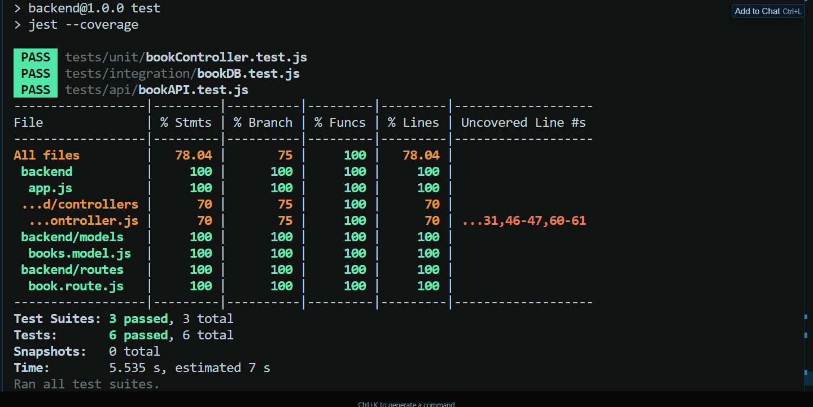

# BookNerd-Haven Backend

## 📚 API Overview

This backend provides a RESTful API for managing a collection of books. It supports CRUD operations:

- **GET /api/books**: List all books
- **POST /api/books**: Add a new book
- **PUT /api/books/:id**: Update a book by ID
- **DELETE /api/books/:id**: Delete a book by ID

## 🛠 Tech Stack

- **Node.js**
- **Express.js**
- **MongoDB** (with Mongoose)
- **Jest** (testing)
- **Supertest** (API testing)
- **mongodb-memory-server** (integration testing)
- **Babel** (ESM support)

## 🚀 How to Run the Application

1. **Install dependencies:**
   ```bash
   npm install
   ```
2. **Set up environment variables:**
   - Create a `.env` file in the backend directory with:
     ```env
     MONGO_URI=your_mongodb_connection_string
     ```
3. **Start the server:**
   ```bash
   npm run dev
   ```
   The server will run on `http://localhost:5000` by default.

## 🧪 How to Run Tests

Run all tests and generate a coverage report:

```bash
npm test
```

## 🧰 Testing Frameworks/Tools Used

- **Jest**: Unit, integration, and API testing
- **Supertest**: HTTP assertions for API endpoints
- **mongodb-memory-server**: In-memory MongoDB for integration tests
- **Babel**: For ES module support in tests

## 📊 Test Coverage

Below is a screenshot of the test coverage achieved:


---
